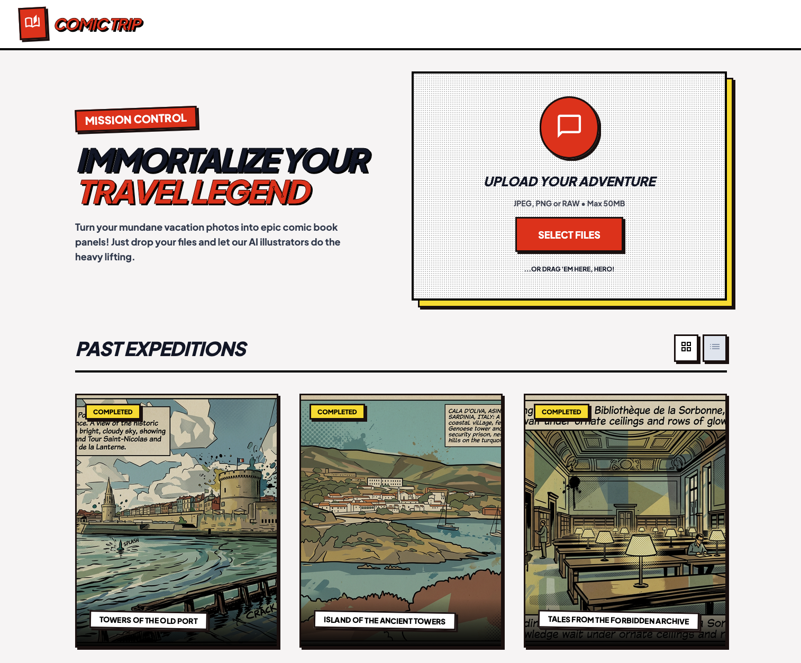
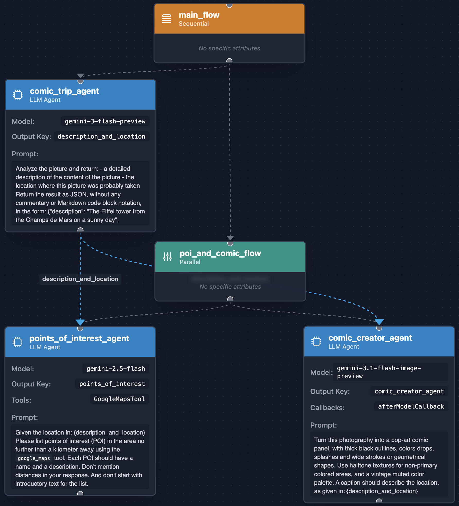

# Comic Trip Agent



The **Comic Trip** travel agent is an application that analyzes your travel photos 
and transforms them into a vibrant pop-art comic strip experience. 
It not only stylizes your pictures but also intelligently 
identifies the location and provides nearby points of interest.

The application is built using the 
[Agent Development Kit (ADK) for Java](https://google.github.io/adk-docs/), 
which allows us to define specialized agents, equip them with specific tools, 
and compose them into complex, multi-step workflows.

The web backend of the application is built with the [Quarkus](https://quarkus.io/) framework.
Quarkus receives the uploaded pictures and sends them in parallel to the Comic Trip agent for processing.

## How It Works

The core intelligence and orchestration of the application are handled in 
[`src/main/java/comictrip/ComicTripAnalyzer.java`](src/main/java/comictrip/ComicTripAnalyzer.java).

### Agent Structure and Orchestration

The image analysis and generation process is driven by multiple specialized AI agents, 
using different Gemini models, orchestrated both sequentially and in parallel:



1.  **`comicTripAgent` (LlmAgent)**
    *   **Model:** `gemini-3-flash-preview`
    *   **Task:** Analyzes the uploaded picture to extract a detailed description of its contents 
        and identifies the probable location where it was taken.
    *   **Output:** Returns a structured JSON payload containing the `description` and `location`.

2.  **`comicCreatorAgent` (LlmAgent)**
    *   **Model:** `gemini-3.1-flash-image-preview` (aka 🍌 Nano Banana 2)
    *   **Task:** Takes the extracted description and location, and transforms the original photography 
        into a pop-art comic panel featuring thick black outlines, color drops, halftone textures, and a vintage palette.
    *   **Callbacks:** Utilizes an `afterModelCallback` to intercept the multimodal LLM response,
        extract the generated image bytes, save the file locally (for debugging purpose), and persist it as an artifact.

3.  **`poiGoogleMapsAgent` (LlmAgent)**
    *   **Model:** `gemini-2.5-flash`
    *   **Tools:** `GoogleMapsTool`
    *   **Task:** Uses the location identified by the first agent to list points of interest (POI) 
        within a kilometer radius, providing a name and description for each location using Google Maps data.

4.  **`poiAndCommicFlow` (ParallelAgent)**
    *   **Task:** Orchestrates the `comicCreatorAgent` and `poiGoogleMapsAgent` to run simultaneously.
        Since both agents depend on the output of the initial analysis but are independent of each other, 
        running them in parallel significantly improves the overall processing time.

5.  **`mainFlow` (SequentialAgent)**
    *   **Task:** The root flow that strictly orders the execution: 
        it first runs the `comicTripAgent` to gather the necessary context, 
        and subsequently triggers the `poiAndCommicFlow`.

### ADK Core Concepts

*   **`App` and `Plugins`**: The entire agent graph (`mainFlow`) is wrapped inside an `App` container named `comic_trip_app`. 
    It utilizes a `LoggingPlugin` for execution observability and debugging.
*   **`Runner` and `Session`**: An `InMemoryRunner` is configured to execute the `App`. 
    It manages the state and context across different agent steps using an `InMemorySessionService`.
    The context is organized and isolated by a `SessionKey` based on the specific app, user, and trip ID.

## Storage Architecture

The application uses two primary storage mechanisms on Google Cloud to handle structured data and media artifacts:

1.  **Google Cloud Storage (GCS)**
    *   **Usage**: Stores the generated pop-art comic image files.
    *   **Implementation**: Fully integrated into the ADK `Runner` configuration using `GcsArtifactService`. 
        It handles the upload of generated artifacts to the `comic-trip-picture-bucket`. 
        During the `comicCreatorAgent`'s callback phase, the image is passed to `callbackContext.saveArtifact(...)` 
        to safely upload the generated media to GCS.
    *   **Directory Structure**: The ADK structures artifacts hierarchically based on the app name, user, 
        session (trip ID), and artifact name. The resulting path in the bucket looks like this:
        ```text
        gs://comic-trip-picture-bucket/comic_trip_app/comic_trip_user/{tripId}/{imageId}.png/0
        ```

2.  **Firestore Database**
    *   **Usage**: Stores the structured metadata of the generated trips.
    *   **Implementation**: Managed by `TripService.java`. It persists trip data to the `comic-trip` Firestore database 
        inside the `trips` collection. The stored documents include the trip's title and an array of picture objects 
        containing their textual descriptions, recognized locations, generated image URLs (pointing to the GCS bucket), 
        and the nearby points of interest gathered by the agents.
    *   **Data Structure**: Each document in the `trips` collection represents a single trip (identified by `{tripId}`)
        and is structured as follows:
        ```json
        {
          "tripId": "x7bY9p",
          "title": "GALATA GOLD: ISTANBUL RISING",
          "pictures": [
            {
              "tripId": "x7bY9p",
              "image": {
                "name": "https://storage.googleapis.com/comic-trip-picture-bucket/.../{imageId}.png/0",
                "mimeType": "image/png"
              },
              "details": {
                "description": "A view of the iconic Galata Tower...",
                "location": "Galata Tower, Istanbul, Turkey"
              },
              "pointsOfInterest": "* Torre Galata...\n* Kamondo Stairs..."
            }
          ]
        }
        ```

## Deployment

For instructions on how to build and deploy the Comic Travel Agent application to Google Cloud Run from source, 
please refer to the [Deployment Guide](DEPLOY.md).

---

## License

This project is licensed under the [Apache License, Version 2.0](LICENSE).

## Disclaimer

This is not an official Google project.
